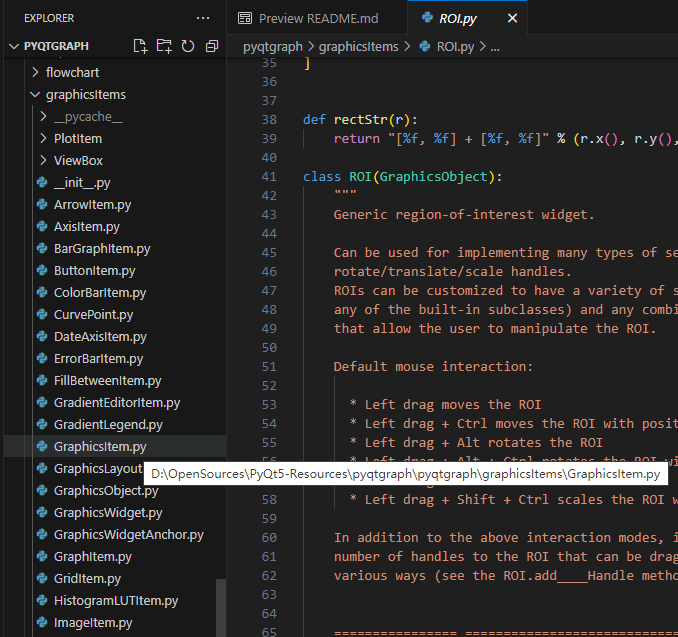
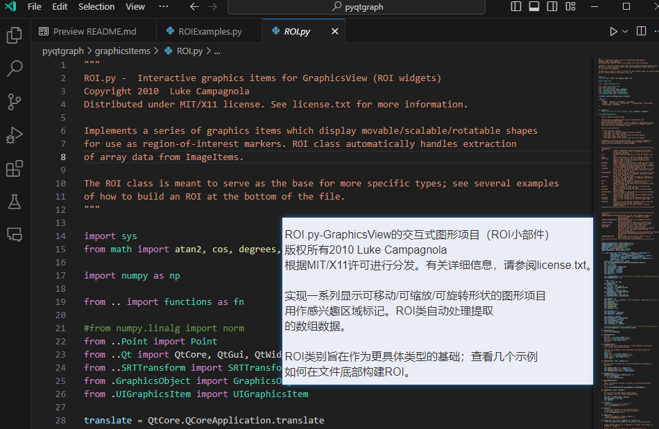

- 基于PyQt来实现一个截图工具，整体的截图体验参考Snipaste的交互方式，绘图体验则借鉴excalidraw
- ## 前言
  本人已经使用Snipaste+自建剪贴板OCR(autoHotkey/uTools+cnocr/paddleocr)的组合很长时间了，逐渐发现这套操作方式不够方便
  
  另外，snipaste的桌面贴图如果能够应用到桌面绘图上那就更好了，做教学演示就能更加方便啦
  
  可惜搜了一圈，找到了ppInk、shareX等截图、标注类应用，但它们都不怎么合适，本人内心里还是更喜欢Snipaste的交互设计，遂萌发出自己捣弄一个类似应用的想法，在我的设想里它拥有更现代的UI风格，并且易于拓展，最好能跨平台，有snipaste常用的某些功能和交互方式
  
  在将这些想法一一整理之后，在Flutter、Electron、Qt等技术上做了次选型，但是一直不太满意，因为易于拓展意味着开发环境尽可能简单，想做离线OCR识别离不开Python，所以迟迟没动手；直至看到了 [PyQt-Fluent-Widgets](https://github.com/zhiyiYo/PyQt-Fluent-Widgets) 项目的演示，一下子被它所吸引了，之后陆陆续续基于PyQt5复刻了Snipaste上自己常用到的功能，并且结合excalidraw的操作方式封装了一套绘图层和相关示例
  
  当然，在这个过程中，也留意到有个PixPin应用，该作者的开发动机同本人蛮接近的，经过一番调研后发现，他想做的东西无疑更大更全，而我只是想要个自用的称手工具而已，很多高级特性根本用不上，因此本项目就继续推进了
- ## 功能特点
	- 截图
		- DONE 选区截图，类似snipaste
		- DONE 多屏幕截图支持，类似snipaste
		- DONE 自识别选区截图，类似snipaste
		- 滚动截图，参考[Jamscreenshot](https://github.com/fandesfyf/Jamscreenshot)
	- 贴图
		- DONE 将截图钉到屏幕上，类似snipaste
		- DONE 贴图闪屏效果支持
		- DONE 鼠标穿透支持
	- DONE 通用白板绘图（`截图标注`、`桌面标注`），考虑编写一个PyQt版本的通用绘图库，整体操作参考excalidraw的操作习惯，对svg支持友好
		- DONE 矩形
		- DONE 椭圆
		- DONE 文本
		- DONE 线条（含贝塞尔线条、折线）
		- DONE 橡皮擦
		- DONE 箭头
	- DONE OCR识别
		- 支持PaddleOCR
		- 支持OcrMyPdf
	- 图片翻译
		- 类似日漫汉化之类的效果，将图片上的文本涂抹掉，然后填充回翻译后的文本，考虑下以插件形式提供该功能
		- 参考资料
			- https://ocr.wdku.net/index_pictranslation
			- https://www.basiccat.org/zh/imagetrans/
			- https://www.basiccat.org/zh/tagged/#imagetrans
			- https://www.appinn.com/cotrans-manga-image-translator-regular-edition/#google_vignette
			- https://github.com/KUR-creative/SickZil-Machine
			- https://www.bilibili.com/read/cv7181027/
			- https://github.com/zyddnys/manga-image-translator
			- https://github.com/jtl1207/comic-translation
	- DONE 快捷键自定义
	- DONE 多语言支持
	- 笔锋笔形支持
		- [Qt 实现钢笔画线效果详细原理_qt 钢笔工具-CSDN博客](https://blog.csdn.net/luoyayun361/article/details/104340258)
		- [Qt 实现画线笔锋效果详细原理_qt 划线-CSDN博客](https://blog.csdn.net/luoyayun361/article/details/104312253)
		- [原笔迹手写实现平滑和笔锋效果之:笔迹的平滑(一) - 88911562 - 博客园 (cnblogs.com)](https://www.cnblogs.com/zl03jsj/p/8047259.html)
		- [原笔迹手写实现平滑和笔锋效果之:笔迹的平滑(二) - 88911562 - 博客园 (cnblogs.com)](https://www.cnblogs.com/zl03jsj/p/8048102.html)
		- [原笔迹手写实现平滑和笔锋效果之:笔锋效果(三)[完结篇] - 88911562 - 博客园 (cnblogs.com)](https://www.cnblogs.com/zl03jsj/p/8051912.html)
	- 特殊菜单
		- [Qt，C++开发炫酷圆形扇形菜单面板_qt 圆形窗口-CSDN博客](https://blog.csdn.net/wastelandboy/article/details/123492815)
		- [Qt自定义圆形环状菜单_qt环形菜单-CSDN博客](https://blog.csdn.net/qq_40162965/article/details/112374406)
		- [Qt之悬浮球菜单 - 朝十晚八 - 博客园 (cnblogs.com)](https://www.cnblogs.com/swarmbees/p/16837670.html)
- 参考资料
	- https://maicss.gitbook.io/pyqt-chinese-tutoral/
	- https://github.com/fandesfyf/Jamscreenshot
	- https://zh.snipaste.com/
	- https://github.com/pyqtgraph/pyqtgraph
	- https://gitlab.com/pavel.krupala/pyqt-node-editor
		- 建议先跟着这个教程开发一个节点编辑器，然后熟悉QGraphicView的相关开发技术，方便自行来实现各种绘图工具
		- {{video https://www.youtube.com/watch?v=YV2mEYd7nyM&list=PLZSNHzwDCOggHLThIbCxUhWTgrKVemZkz&index=2}}
	- 对于如何绘制现有图元这个东西来说，可以从pygraph这个第三方库里提取出来，如下图所示：
		- 
		- 