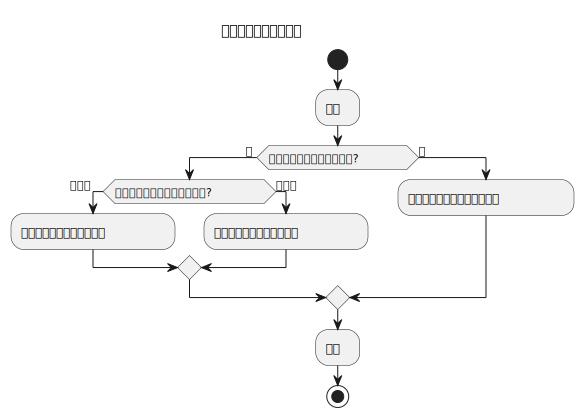

- >分析了Snipaste，发现它的贴图窗口支持了一个鼠标穿透功能，这个功能我也经常使用到，以下是对其分析和复刻
- ### 流程拆解
	- {:height 426, :width 585}
- ### 实现思路
	- 给`贴图Widget`添加上一个判断是否穿透窗口的方法(通过判断WindowFlags里是否包含`Qt.WindowTransparentForInput`来获知)，在`主Widget`用一个数组来存放所有打开的贴图窗口，并且封装好Wrap方法给快捷键快速调用
- ### 代码片段
	- ```python
	      # 鼠标穿透策略：优先判断获取焦点窗口的
	      def changeMouseThough(self):
	          focusFreezeWnd:FreezerWindow = None
	          screenPos = QCursor.pos()
	          for freeze_img in self.freeze_imgs:
	              if freeze_img != None and freeze_img.geometry().contains(screenPos):
	                  focusFreezeWnd = freeze_img
	                  break
	          if focusFreezeWnd != None:
	              focusFreezeWnd.changeMouseThought()
	          else:
	              for freeze_img in self.freeze_imgs:
	                  freeze_img.setMouseThought(False)
	  
	  ```
	- ```python
	      # https://zhangzc.blog.csdn.net/article/details/113916322
	      # 改变窗口穿透状态
	      def changeMouseThought(self): # 改变窗口穿透状态
	          """ setWindowFlags(self, type: Union[Qt.WindowFlags, Qt.WindowType]) """
	          if self.isMouseThought():
	              self.setWindowFlags(self.windowFlags() & ~Qt.WindowTransparentForInput)
	          else:
	              self.setWindowFlags(self.windowFlags() | Qt.WindowTransparentForInput)
	  
	          self.show()
	  
	      def setMouseThought(self, can:bool):
	          if can:
	              self.setWindowFlags(self.windowFlags() | Qt.WindowTransparentForInput)
	          else:
	              self.setWindowFlags(self.windowFlags() & ~Qt.WindowTransparentForInput)
	  
	          self.show()
	  
	      # 判断窗口的鼠标是否穿透了
	      def isMouseThought(self):
	          return (self.windowFlags() | Qt.WindowTransparentForInput) == self.windowFlags();
	  
	  ```